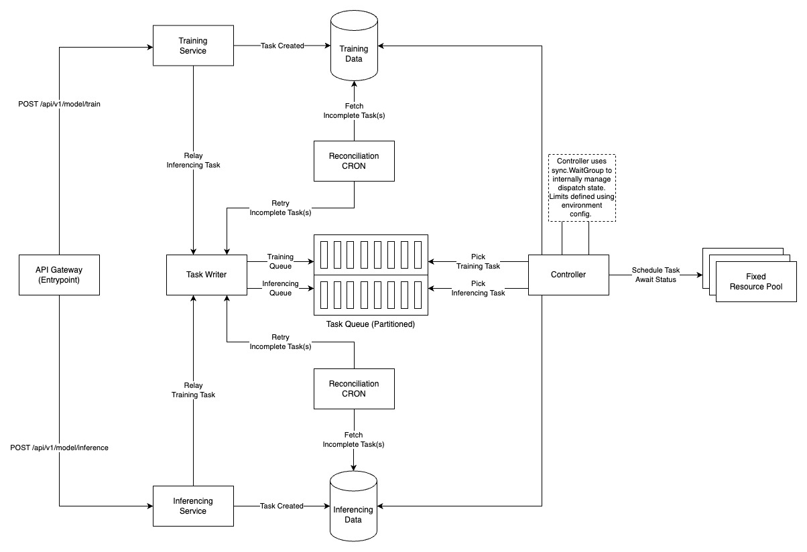
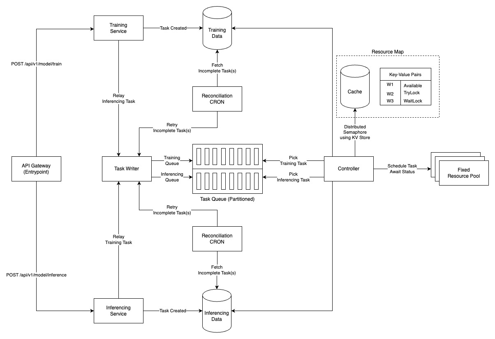
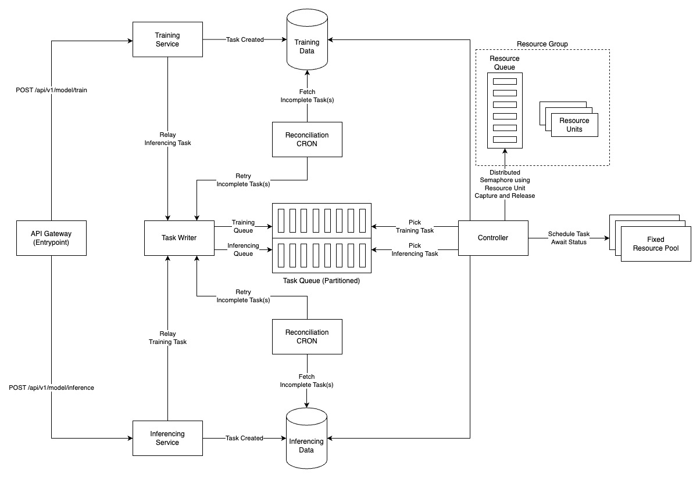
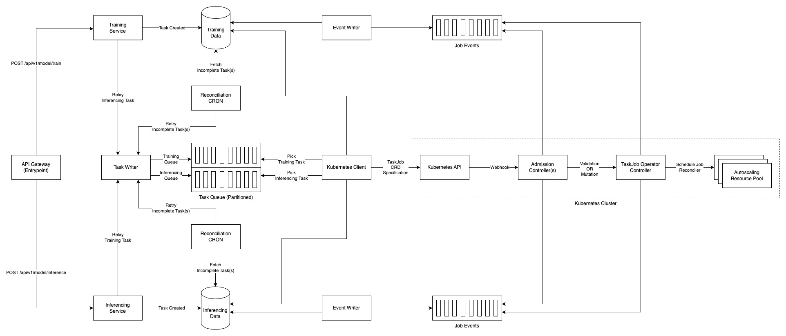

# ML Infrastructure for Image-Model based Workloads

## Application, Problem Statement, Goal and Background Context
We were working on a product called NeverAI; an AI-image editing SaaS app, which at the time was the main product offering from Totality Corp. As a user you would need to submit 10-12 images of yourself, using which the system would train an image model. Once the model was trained, you could choose from a collection of portraits that you would want to see yourself as.
Example: Your face in an astronauts’ suit standing on Martian soil, etc.

Training and inference - which were the operations we needed to perform at the backend were resource and time intensive. We had a fixed pool of GPU-enabled nodes made available to us. Our goal was to create a system that could leverage the resource pool to handle both types of workloads at scale.

A team of 4 engineers (not including myself) had built a system we went live with. We quickly discovered that it was error-prone, had significant drop and failure rates, and required manual intervention (sometimes investigation) at least twice every week. This went on for 3-months, until nobody wanted to touch that system.

The team realized that the design itself was flawed, and they sought my help in redesigning its replacement. The following description reflects the subsequent systems (multiple-iterations) I designed, presented, and the one I eventually developed.

### Approach 1:
#### Design:

#### Description:
- Use a task queue to buffer the influx of tasks.
- Controller is responsible for scheduling and tracking the status of the tasks.
- Controller knows which nodes are suited for what type of tasks. For example, a training task would be better suited for a node with larger resource attachments.
- Controller manages running tasks using a channel multiplexer controlled using Go’s sync.WaitGroup.
- Controller’s WaitGroups are to be partitioned if multiple regions are using a common resource pool.
- Reconciliation jobs for reattempting dropped workloads (timeouts, failures etc.).
#### Benefits:
- Asynchronous handling of tasks.
- Suitable for fixed-resource pools.
- Workloads can have priority based on workload type.
#### Drawbacks:
- Controller process tracks the API address and the state of the workers in memory, making it vulnerable to process crashes.
- Modification of the number of workers, or the API address requires manual intervention, along with process restarts.
- Controller assumes availability of all nodes on start. Transgression may result in inefficient performance, timeouts, or crashes, and may require manual intervention.
- One node/worker can only process one task at a time.
- Controller WaitGroups require partitioning in case of multiple regions using a common resource pool, making it resource inefficient.
- Each node from the pool must be bound to a Controller instance.
- Does not support auto scaling resource pools.

### Approach 2:
#### Design:

#### Description:
- Improve Approach-1 using a key-value store for two-phase locking for a distributed semaphore.
#### Benefits:
- Extracts the state of locks from the Controller process, increasing durability.
- Locks need not be partitioned if multiple regions are using a common resource pool, increasing efficiency.
- Nodes need not be bound to a Controller instance.
- Controller needs to know beforehand which nodes are suited for what type of workload.
#### Drawbacks:
- The Controller process needs to know which keys it can query from the KV store.
- Controller performs short-polling on the KV store.
- The KV store needs to maintain information on the nodes’ support for workload type.
- Modification of the number of workers still requires manual intervention.
- One node/worker can only process one task at a time.
- Does not support auto scaling resource pools.

### Approach 3:
#### Design:

#### Description:
- Improve upon Approach-2 using a resource queue consisting of resource units as the currency for available resources. Once a response is returned for a corresponding task, resource units are to be made free.
#### Benefits:
- The Controller no longer needs to know the keys beforehand. It subscribes to a topic that holds the relevant information required to operate a worker.
- Heterogeneous workloads can be operated on the same node.
- Nodes of all resource sizes can be added to the fixed pool.
- Granular resource control using resource units as operating currency.
#### Drawbacks:
- Does not support auto scaling resource pools.
- Resource units are anchored to a single resource type. Example: GPU.
- Resource units are quantified based on assumptions, with consumption based on previous benchmarks. Additional steps may be required to uphold the basis of assumption. Example: Cleaning up disk space etc. at regular intervals.
### Approach 4:
#### Design:

#### Description:
- Improve upon Approach-3 using Kubernetes operator pattern to manage and control execution of jobs, increasing system resiliency.
- The Admission Webhook Controller, and the Operator report job status to an event queue, which get relayed to a database.
#### Benefits:
- Supports auto-scaling.
- Scheduling can happen based on multiple resource specifications (requirements, limits).
- Workloads can specify priority classes independent of workload type.
#### Drawbacks:
- Requires advanced knowledge of Kubernetes.

## Execution Plan and Impact:
I covered approaches 1, 2, and 3 in depth in a Q&A session with the team, highlighting the benefits and the drawbacks each iteration adds and reduces. This helped the team understand my thought process while building systems, and compare differences between each approach, making sense of the impact of modifications.

The pipeline remained operational, and never triggered failure or drop alerts except for the one time we simulated a process failure. The reconciliation job was able to pick up the dropped tasks without requiring manual intervention.

I also conducted a posteriori analysis of the pipeline, coming up with a formula that predicted results for the time it'd take for a task to be executed based on scheduling sequence, and the state and health of the controller.

I’d observed it handling 100+ tasks, utilizing all available workers. It is to be noted that it was designed to handle much more (limitation based on app popularity, paywall). For comparison, the previous system would break beyond 10-15 task assignments.

Approach 4 never made it to production during my time at the organization. However, at present I've picked up work on it, intending to finish the work as a part of one of my personal projects. The approach should be applicable to a large set of use cases, for example: ML workloads, media transcoding, data processing, etc.
